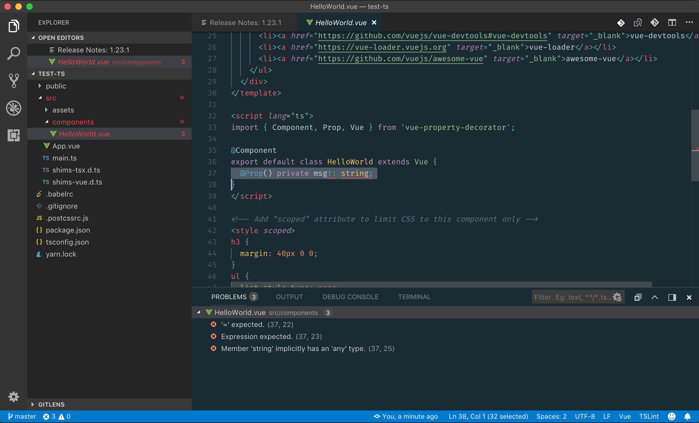

# TypeScript error in VisualStudio Code in bare vue-cli project

## How to reproduce

Clone this repo

or

* `$ npx vue-cli create test-typescript`
* Select only the "TypeScript" option
* Open the created project in VSCode
* open the file `HelloWorld.vue`
* You should see the rrors below

